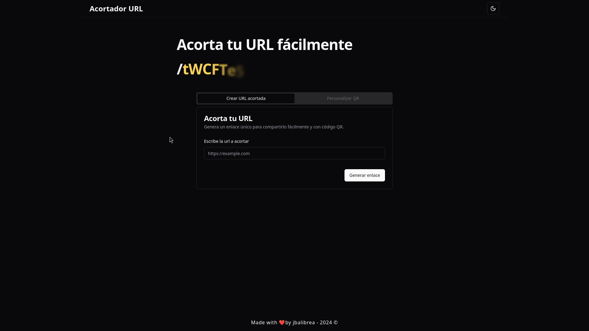
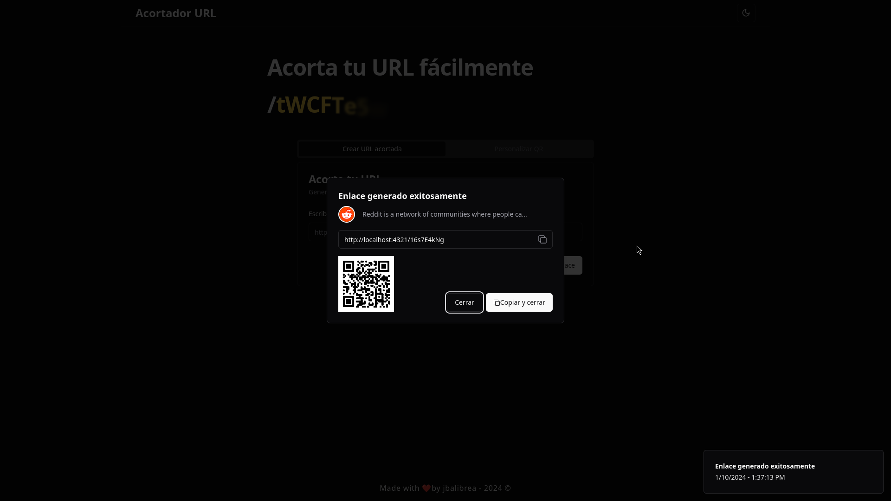

# Short URL Frontend




This is the frontend for the URL shortener project. It is built using the following technologies:

- **Astro**: A modern static site generator that combines different technologies and components to create fast and efficient websites.
- **React**: Used to build interactive and dynamic UI components.
- **Tailwind CSS**: For designing the UI with a utility-first approach.
- **Shadcn**: A library of styled components, integrated with Tailwind CSS.

## Prerequisites

To run this project, you need to have the following installed:

- [Node.js](https://nodejs.org/)

This frontend requires a connection to one of the APIs available at [short-url-back](https://github.com/jbalibrea1/short-url-back) to work correctly. You can choose between two backend implementations:

- **Go API**: For the Go version, follow the instructions in the [Go backend README](https://github.com/jbalibrea1/short-url-back/tree/main/back-go).
- **Express API**: For the Node.js with Express version, follow the instructions in the [Express backend README](https://github.com/jbalibrea1/short-url-back/tree/main/api-express).

## Running the Project

To install dependencies and run the project locally, use:

```bash
# If you don't have pnpm installed, run:
npm install -g pnpm

# Then, install dependencies and run the project:
pnpm i
pnpm dev
```

## Future Improvements

- [ ] Environment variables: Implement the use of environment variables through a .env file to configure the API URL and other settings. Currently, the project is not using environment variables in .tsx files (because I had a struggle importing environment in tsx, not in astro), which is a feature that needs improvement to better manage development and production environments.
